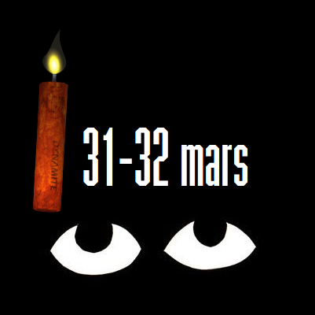
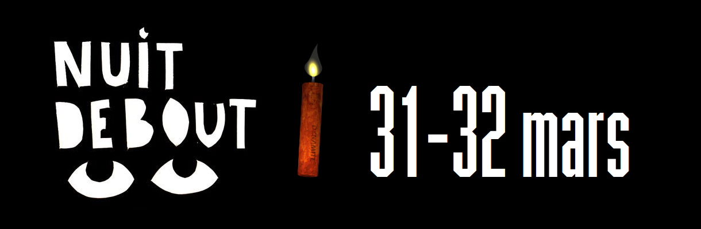

# Logos Nuit Debout 31-32 mars

Faisant écho à des voix portées sur Telegram et sur des [Pads de Nuit Debout](https://nuitdebout.fr/blog/2017/01/05/pad-des-pads-de-nuit-debout/), ce dépôt accueille des éléments visuels que chacun.e peut reprendre à sa guise.

Chacun.e peut ajouter ici d'autres éléments, en se connectant (bouton "Sign-in")
avec le Pseudo : debout
et le mot de passe : motdepasse
Cliquer sur le bouton "upload files" pour envoyer les fichiers (pour les remplacer par des versions modifiées, juste garder leur nom original). Pour valider, cliquer sur "Commit changes". 
Ensuite cliquer sur le Readme.md puis sur le petit crayon (mode modifications) afin de les énumérer tout en bas de cette liste. Une fois dans le mode Modifications, vous verrez dans le numéro I la syntaxe GitHub, facile à reproduire pour qu'apparaissent leurs miniatures.

Graphistes debout et webgalleristes, n'hésitez pas à ajouter la référence de votre site web à la suite du nom de vos fichiers ci-après.

Conservez votre version aussi dans votre disque local (chez vous) par simple prévention, car il n'est pas rare que les fichiers hébergés en ligne s'avèrent défectueux (inexploitables), et les personnes suivantes ici pourraient la supprimer par erreur, l'accès est libre à tous les niveaux d'utilisation.

# Numéro .-. Expéditrice/Expéditeur .-. Nom des fichiers .-.  Sources ou infos

I. 32 mars dynamitique, par zaguán "antislash" (items bruts dans le fichier 32marsDynamitiqueCalques.zip)

 

Sources : Les yeux http://www.madinin-art.net/la-voie-des-nuits/ et la police de caractère https://wiki.nuitdebout.fr/wiki/Ressources/Logotype_et_caract%C3%A8re_typographique_de_la_Nuit_Debout sont de Nuit Debout, la dynamite http://3.bp.blogspot.com/-GaYzihsZ-Uc/UlKnqSTAz6I/AAAAAAABHcM/PeJu1l8wLCc/s320/DYNA.png sort d'une vieille planque de 2013 bien conservée (d'un graphiste libriste de NewsdzeZimbabwe) et la flamme de bougie provient de https://openclipart.org/detail/174363/candles

II. Présentez ici les vôtres :

III. Placez ici les vôtres :

